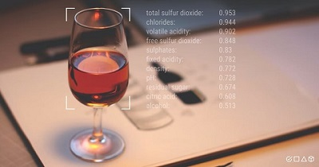

# Data-Science-Portfolio
#### Technical Skills: Python, SQL, Snowflake, SAS(SAS Advance Certified), R, Tableau, Quicksight

## Education
- Biostatistics, M.S. | American University (_May 2022_)
- Food Science, B.S. | University of Maryland (_May 2018_)
  
## Data Science Projects
#### Research Assistant for <a href="https://new.nsf.gov/funding/opportunities/algorithms-threat-detection-atd">Algorithms for Threat Detection</a> Project
-	Used Markov Random Field to build logistic regression models from 911 call data during 2015 Baltimore riots
-	Applied pseudo-likelihood estimation to maximize essential parameters to detect change-point 
-	Predicted possibility of large-scale violence through detection of change-points in Markov Chains

#### [Machine Learning Project](https://github.com/ZhongyanLiang/ML-Project-with-Multinomial-Logistic-Regression-Model/blob/main/README.md) with Multinomial Logistic Regression Model
- Built multinomial logistic regression model to assess wine quality (rank from 1-10) with variables such as residual sugar, alcohol, and density etc.
- Conducted tests such as VIF, Stepwise Variables Selection, Linear and Quadratic Discriminant analysis, KNN, and Random Forest to cross-validate and further optimize the model
  

#### [Machine Learning | Credit Card Fraud Detection]() with random forest model
- Built a Random Forest model to quickly detect anomaly and classify fraudulent transaction
- AUPRC was utilized to measure model accuracy because of unbalanced data

## Work Experience
**Senior Business Analyst @ Capital One (_Feb 2022 - Oct 2023_)**
- Delivers high value data, analysis, & reporting solutions to support company's flagship digital servicing platform, which is used by over 40 million monthly active users and supported by over 500 internal software engineers
- Developed ordinal logistic regression model with mobile platform user data which identified improvement oppotunities on promoting/detracting features that contributed to 25% increase on user popularity
  
**Data Analyst @ Centurion Health (_Jan 2020 - Jan 2022_)**
- Developed automated data pineline in SAS to collect, clean and store millions of patients claim and prescription data, which reduced data mining turn around time by 50%
- Developed linear regression model to predict prescription demand by evaluating patient and prescriber prescription patterns, which helped avoid prescription supply insufficiency across facilities
  

